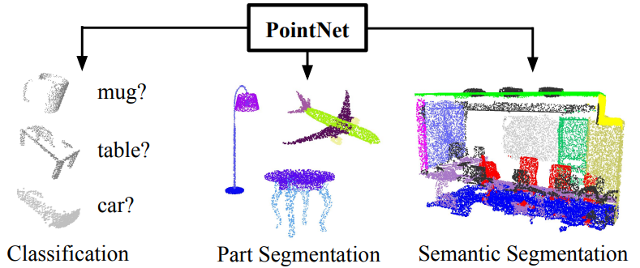
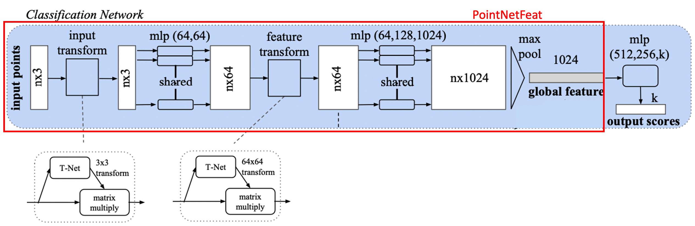
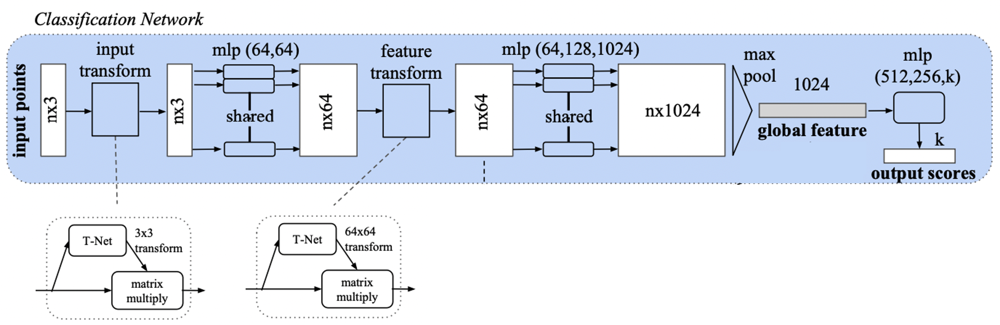
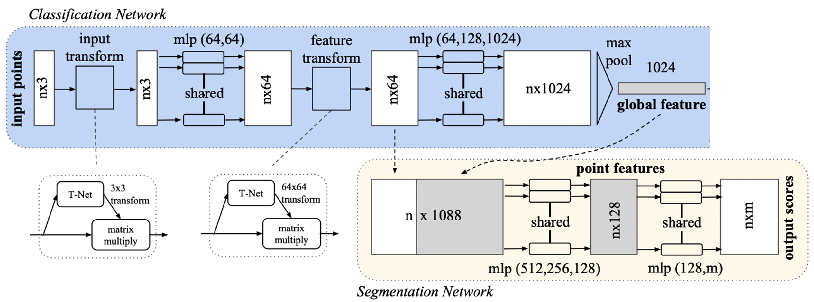
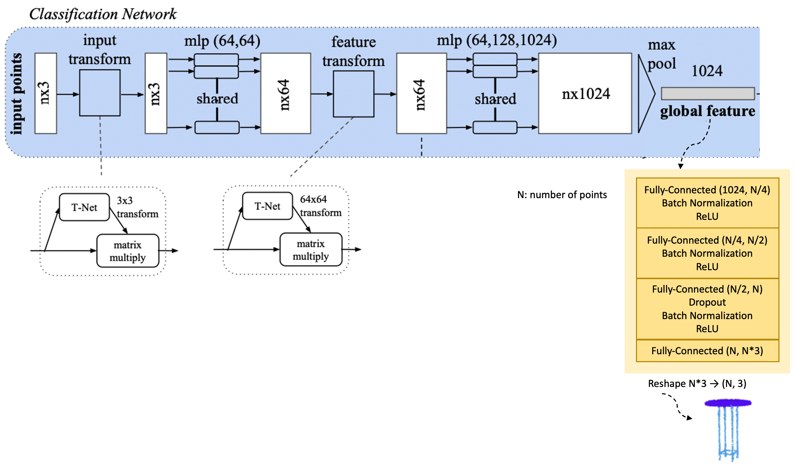
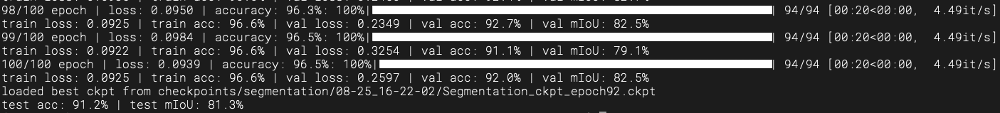

<div align=center>
  <h1>
    PointNet: Point Cloud Processing Network
  </h1>
  <p>
    <a href=https://mhsung.github.io/kaist-cs479-fall-2023/ target="_blank"><b>KAIST CS479: Machine Learning for 3D Data (Fall 2023)</b></a><br>
    Programming Assignment 1    
  </p>
</div>

<div align=center>
  <p>
    Instructor: <a href=https://mhsung.github.io target="_blank"><b>Minhyuk Sung</b></a> (mhsung [at] kaist.ac.kr)<br>
    TA: <b>Hyunjin Kim</b>  (rlaguswls98 [at] kaist.ac.kr)      
  </p>
</div>

<div align=center>
  
</div>

#### Due: September 17, 2023 (Sunday) 23:59 KST
#### Where to Submit: Gradescope

## Abstract

[PointNet](https://arxiv.org/abs/1612.00593) is a fundamental yet powerful neural network processing point cloud data. In the first tutorial, we will learn how to use PointNet for different tasks including _classification_, _auto-encoding_, and _segmentation_ by implementing them. Since we aim to make you familiar with implementing neural network models and losses using Pytorch, we provide skeleton codes and what you have to do is just fill in the **TODO** parts of the codes. Before implementing codes, please read the [PointNet](https://arxiv.org/abs/1612.00593) paper together with [our brief summary](https://geometry-kaist.notion.site/Tutorial-1-PointNet-12e12629c85e40779f18633f1e7144b7?pvs=4) and the provided codes careful and check how codes flow. Also, we recommend you to read how to implement codes using Pytorch ([Pytorch Tutorial link](https://pytorch.org/tutorials/beginner/pytorch_with_examples.html)).


<details>
<summary><b>Table of Content</b></summary>
  
- [Abstract](#abstract)
- [Setup](#setup)
- [Code Structure](#code-structure)
- [Tasks](#tasks)
  - [Task 0. Global Feature Extraction](#task-0-global-feature-extraction)
  - [Task 1. Point Cloud Classification](#task-1-point-cloud-classification)
  - [Task 2. Point Cloud Part Segmentation](#task-2-point-cloud-part-segmentation)
  - [Task 3. Point Cloud Auto-Encoding](#task-3-point-cloud-auto-encoding)
- [Submission Guidelines](#submission-guidelines)
- [Grading](#grading)
- [Further Readings](#further-readings)
</details>

## Setup

We recommend creating a virtual environment using `conda`.
By following below commands, you can create and activate the conda environment.
```
conda create -n pointnet python=3.9
conda activate pointnet
```

After that, install pytorch 1.13.0 and other essential packages by running:
```
conda install pytorch=1.13.0 torchvision pytorch-cuda=11.6 -c pytorch -c nvidia
conda install -c fvcore -c iopath -c conda-forge fvcore iopath
conda install pytorch3d -c pytorch3d
```

Lastly, install remained necessary packages using `pip`:
```
pip install tqdm h5py matplotlib
```


## Code Structure
Below shows the overall structure of this repository. Bascially, in this tutorial, what you have to do is implementing models and losses by filling in the **TODO** parts of below 4 files.
### TODOs
```
- model.py
- train_cls.py
- train_ae.py
- train_seg.py
```

```
pointnet
│ 
├── model.py              <- PointNet models implementation. <TODO>
│ 
├── dataloaders 
│   ├── modelnet.py         <- Dataloader of ModelNet40 dataset.
│   └── shapenet_partseg.py <- Dataloader of ShapeNet Part Annotation dataset. 
│
├── utils
│   ├── metrics.py          <- Easy-to-use code to compute metrics.
│   ├── misc.py             <- Point cloud normalization ft. and code to save rendered point clouds. 
│   └── model_checkpoint.py <- Automatically save model checkpoints during training.
│
├── train_cls.py          <- Run classification. <TODO>
├── train_ae.py           <- Run auto-encoding. <TODO>
├── train_seg.py          <- Run part segmentation. <TODO>
├── visualization.ipynb   <- Simple point cloud visualization example code.
│
├── data                  <- Project data.
│   ├── modelnet40_ply_hdf5_2048     <- ModelNet40   
│   └── shapenet_part_seg_hdf5_data  <- ShapeNet Part Annotation
│
└── checkpoints           <- Directory storing checkpoints. 
    ├── classification
    │    └── mm-dd_HH-MM-SS/epoch=16-val_acc=88.6.ckpt
    ├── auto_encoding
    └── segmentation
```


## Tasks

### Task 0. Global Feature Extraction



PointNet takes 3D point clouds(# points, 3) as inputs and extracts a 1024-sized global feature latent vector, which contains the geometric information of the input point clouds. This global feature vector will be used in the downstream tasks; point cloud classification, segmentation, and auto-encoding. In this part, you implement PointNetFeat model that only results out the global feature vector so that you can utilize this model for implementing the remaining 3 tasks. 

> :bulb: **The figure above is the guideline for the implementation, but you don't need to implement the code completely the same as it. You can assume that each MLP layer in the figure consists of MLP, batch normalization, and activation.**

#### TODOs
```
- model.py
```
- Fill in the **TODO** in model.py > PointNetFeat class

※ When implementing PointNetFeat, you can utilize `STDkd` we give you in `model.py` code. 

### Task 1. Point Cloud Classification


In point cloud classification tasks, PointNet inputs point clouds (# points, 3) and generates a 1024-sized global feature latent vector, which is then reduced to the number of categories (k) through multi-layer perceptrons, forming logits for each category. 

> :bulb: **The figure above is the guideline for the implementation, but you don't need to implement the code completely the same as it.**

#### TODOs
```
- model.py
- train_cls.py
```
- Fill in the **TODO** in `model.py` > `PointNetCls`
- Fill in the **TODO** in `train_cls.py` > `step` and `train_step`

You can start training the model by the following command. Also, at the end of the training it will automatically test the model on ModelNet40 dataset.

```bash
python train_cls.py
```

Also, you can change `batch_size`, `lr`, and `epochs` by using the command below.
```bash
python train_cls.py --batch_size {batch_size you want} --lr {lr you want} --epochs {epochs you want}
```

While training, if your model achieves the best result, model checkpoint will be saved automatically as `pointnet/classification/MM-DD_HH-MM-SS/Classification_ckpt_epoch{epoch}_metric:{val_Acc}.ckpt`. 


On ModelNet40 test set:
|                                | Overall Acc |
| ------------------------------ | ----------- |
| Paper                          | 89.2 %      |
| Ours (w/o feature trans.)      | 88.6 %      |
| Ours (w/ feature trans.)       | 87.7 %      | 


### Task 2. Point Cloud Part Segmentation


For segmentation tasks, PointNet concatenates the second transformed feature with the global latent vector to form a point-wise feature tensor, which is then passed through an MLP to produce logits for m part labels.

> :bulb: **The figure above is the guideline for the implementation, but you don't need to implement the code completely the same as it.**

### TODOs
```
- model.py
- train_seg.py
```
- Fill in the **TODO** in `model.py` > `PointNetPartSeg`
- Fill in the **TODO** in `train_seg.py` > `step` and `train_step`

You can start training the model by the following command. Also, at the end of the training it will automatically test the model on ShapeNet part dataset.

```bash
python train_seg.py
```

Also, you can change `batch_size`, `lr`, and `epochs` by using the command below.
```bash
python train_seg.py --batch_size {batch_size you want} --lr {lr you want} --epochs {epochs you want}
```

While you are running `train_seg.py`, you are able to see progress bars:


ShapeNet part dataset will automatically be downloaded on `data` directory when `train_seg.py` is first executed.

We provide the code to measure instance mIoU in `utils/metrics.py`.

While training, if your model achieves the best result, model checkpoint will be saved automatically as `pointnet/segmentation/MM-DD_HH-MM-SS/Segmentation_ckpt_epoch{epoch}_metric:{val_mIoU}.ckpt`. 

On ShapeNet Part test set:
|        | ins. mIoU |
| ------ | --------- |
| Paper  | 83.7 %    |
| Ours   | 83.6 %    | 


### Task 3. Point Cloud Auto-Encoding


The PointNet Auto-encoder comprises an encoder that inputs point clouds and produces a 1024-sized global feature latent vector, and an MLP decoder that expands this latent vector incrementally until it reaches N*3. This tensor is reshaped into (N, 3), representing N points in 3D coordinates.

> :bulb: **The figure above is the guideline for the implementation, but you don't need to implement the code completely the same as it.**

### TODOs
```
- model.py
- train_ae.py
```
- Fill in the **TODO** in `model.py` > `PointNetAutoEncoder`
- Fill in the **TODO** in `train_ae.py` > `step` and `train_step`

> :bulb: **We recommend not using the T-Net (input transform and feature transform) in the AE task. That's why we provide the PointNetFeat class without T-Net inside the PointNetAutoEncoder class definition.**

You can start training the model by the following command. Also, at the end of the training it will automatically test the model on ModelNet40 dataset.

```
python train_ae.py
```

Also, you can change `batch_size`, `lr`, and `epochs` by using the command below.
```bash
python train_ae.py --batch_size {batch_size you want} --lr {lr you want} --epochs {epochs you want}
```

While training, if your model achieves the best result, model checkpoint will be saved automatically as `pointnet/auto_encoding/MM-DD_HH-MM-SS/AutoEncoding_ckpt_epoch{epoch}_metric:{val_CD}.ckpt`. 

On ModelNet40 test set:
|        | Chamfer Dist. |
| ------ | ------------- |
| Ours   | 0.0043        |


## What to Submit

Compile the following files as a **ZIP** file named `{NAME}_{STUDENT_ID}.zip` and submit the file via Gradescope.
1. 4 codes that you implemented: `model.py, train_ae.py, train_cls.py, train_seg.py`;
2. Model checkpoint file that achieves the best performance for classification, segmentation, and auto-encoding each;
3. Screenshot at the end of the training for classification, segmentation, and auto-encoding each.

Screenshot Example:



## Grading

**You will receive a zero score if:**
- **you do not submit,**
- **your code is not executable in the Python environment we provided, or**
- **you modify any code outside of the section marked with `TODO`.**
  
**Plagiarism in any form will also result in a zero score and will be reported to the university.**

**Your score will incur a 10% deduction for each missing item in the [Submission Guidelines](#submission-guidelines) section.**

Otherwise, you will receive up to 30 points from this assignment that count toward your final grade.

| Evaluation Criterion | Classification (Acc) | Segmentation (mIoU) | Auto-Encoding (CD) |
|---|---|---|---|
| **Success Condition \(100%\)** | 0.85 | 0.80 | 0.005 |
| **Success Condition \(50%)**   | 0.55  | 0.60 | 0.030 |

As shown in the table above, each evaluation metric is assigned up to 10 points. In particular,
- **Classification (Task 1)**
  - You will receive 10 points if the reported value is equal to or, *greater* than the success condition \(100%)\;
  - Otherwise, you will receive 5 points if the reported value is equal to or, *greater* than the success condition \(50%)\.
- **Segmentation (Task 2)**
  - You will receive 10 points if the reported value is equal to or, *greater* than the success condition \(100%)\;
  - Otherwise, you will receive 5 points if the reported value is equal to or, *greater* than the success condition \(50%)\.
- **Auto-Encoding (Task 3)**
  - You will receive 10 points if the reported value is equal to or, *less* than the success condition \(100%)\;
  - Otherwise, you will receive 5 points if the reported value is equal to or, *less* than the success condition \(50%)\.

## Further Readings

If you are interested in this topic, we encourage you to check out the papers listed below.

- PointNet++: Learning Deep Hierarchical Features from Point Sets in a Metric Space (NeurIPS 2017) 
- Dynamic Graph CNN for Learning on Point Clouds (TOG 2019)
- PointConv: Deep Convolutional Networks on 3D Point Clouds (CVPR 2019)
- PointWeb: Enhancing Local Neighborhood Features for Point Cloud Processing (CVPR 2019)
- KPConv: Flexible and Deformable Convolution for Point Clouds (ICCV 2019)
- PointNeXt: Revisiting PointNet++ with Improved Training and Scaling Strategies (NeurIPS 2022)
- PointMLP: Rethinking Network Design and Local Geometry in Point Cloud: A Simple Residual MLP Framework (ICLR 2022)
- Parameter is Not All You Need: Starting from Non-Parametric Networks for 3D Point Cloud Analysis (CVPR 2023)
